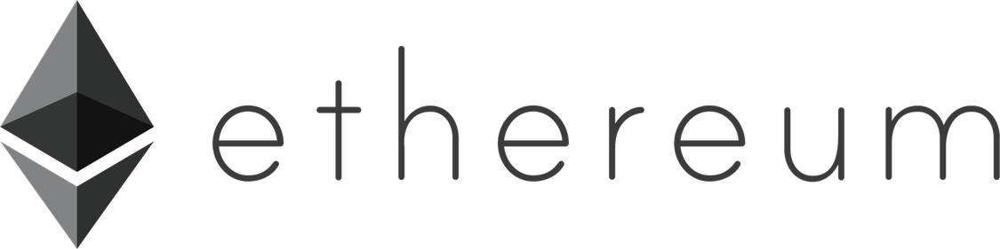

##
## Tokenize Project
Major Topics:
 - extended use of openzeppelin contracts (ownable, crowdsale, ERC20, IERC20)
 - worked with newer ERC20 contract functionality ( ie. _mint() )
 - introduce the idea of crowdsale contracts for token distribution 
 - reinforce & practice contract inheritance, overriding functions (use of super)
 - working with .new() and .deployed() within test scripts

 ## Design

INSERT FLOW CHART HERE

 ## UI

 INSERT UI HERE

